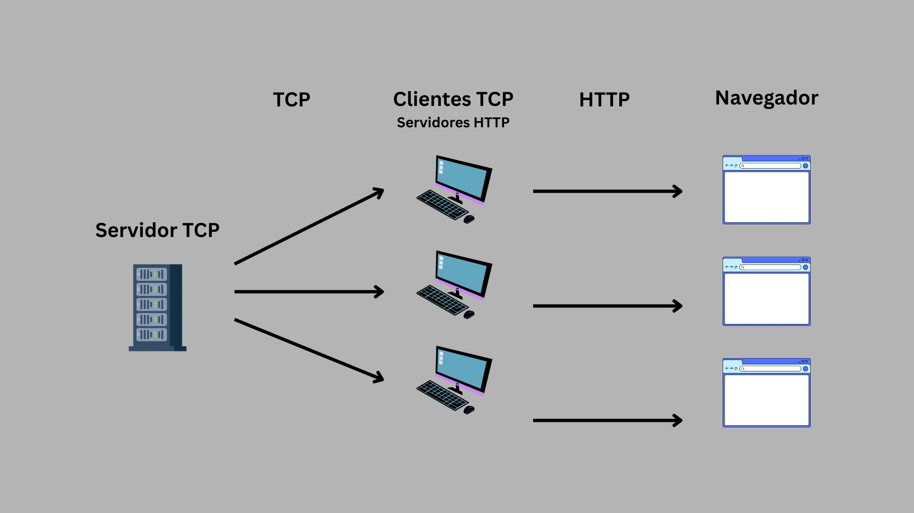
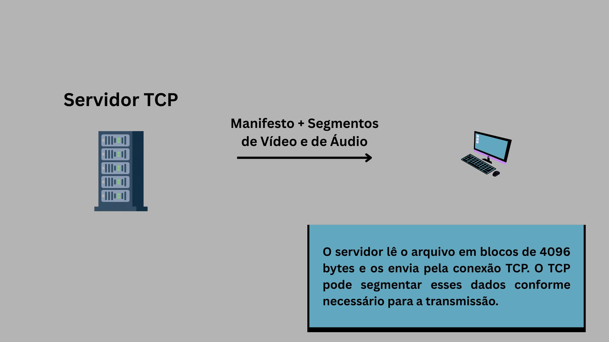
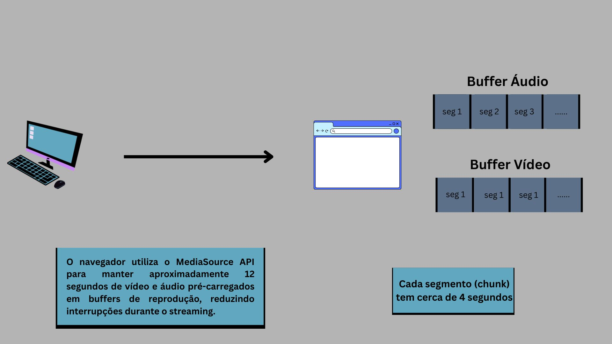

# Trabalho de Streaming de Vídeos Sob Demanda
Trabalho cliente-servidor com reprodução de vídeos por demanda.
## Descrição
Este projeto consiste em uma aplicação de streaming de vídeos sob demanda desenvolvida utilizando comunicação via sockets TCP e interface web em HTTP. O sistema utiliza vídeos segmentados, permitindo reprodução contínua no navegador sem a necessidade de baixar o arquivo completo antes da execução. 

## Arquitetura
O trabalho vai ser divido em dois terminais diferentes do servidor e um do cliente.
<p align="center">
    
</p>

* Cliente TCP solicita manifest.json 
* Servidor TCP envia manifest.json
<p align="center">
    
</p>

* Cliente TCP (Servidor HTML) envia manifest.json para a aplicação HTML (quando solicitada) e ela solicita os segmentos
* Player no navegador
* Reproduz por partes
<p align="center">
    
</p>

## Tecnologias Utilizadas
#### Linguagens
* Go (Golang)
* JavaScript
* HTML/CSS
#### Bibliotecas e Recursos
* net e http do Go
* API MediaSource do JavaScript

#### MediaSource (funcionamento):
* Lê um arquivo de inicialização (init-stream0.mp4)
* Múltiplos segmentos .m4s
* Controla por conta própria qual pedaço será transmitido.

##### Comando FFMPEG, responsável por preparar os vídeos
```bash
ffmpeg -i 1.mp4 -vf scale=-2:360 -map 0:v:0 -map 0:a:0 -c:v libx264 -c:a aac -seg_duration 4 -use_timeline 0 -use_template 1 -remove_at_exit 0 -init_seg_name 'init-stream$RepresentationID$.mp4' -media_seg_name 'chunk-stream$RepresentationID$-$Number$.m4s' -f dash segments/manifest.mpd
```
Os vídeos são convertidos pelo FFmpeg utilizando o codec __*H.264*__ para vídeo e __*AAC*__ para áudio. Em seguida, o conteúdo é segmentado no formato __*MPEG-DASH*__ em blocos de aproximadamente 4 segundos, permitindo que o navegador solicite e reproduza apenas os segmentos necessários durante o streaming.

## Funcionalidades Implementadas
* Servidor TCP para envio de segmentos de vídeo e áudio
* Servidor HTTP para comunicação com o navegador
* Reprodução de vídeo sob demanda
* Streaming segmentado utilizando manifestos
* Controle de qualidade do vídeo
* Bufferização contínua utilizando MediaSource
* Suporte a múltiplos clientes simultâneos através de goroutines

## Melhorias futuras 
* Implementação de sincronização durante a troca de qualidade do vídeo, permitindo que a reprodução continue a partir do ponto exato em que estava antes da alteração de resolução, proporcionando uma experiência mais fluida ao usuário
* Realização testes de carga e desempenho para dimensionar a capacidade do sistema, avaliando a quantidade de clientes simultâneos suportados e o comportamento da aplicação sob diferentes condições de uso.

## Como executar
Como o github não permite envio de arquivos longos, colocamos os vídeos disponíveis em uma pasta que precisa ser baixada.
>[Link Drive](https://drive.google.com/drive/folders/1pEeOQyyr_Tj7p_rU8H4X5jHdGcassdZm?usp=sharing)
Baixe as pastas de videos e thumbnails e as coloque no diretório do trabalho

### 1. Para rodar o servidor
Em um terminal, execute:
```bash
go run mainServer.go
```
### 2. Para rodar o cliente
Em um outro terminal, execute:
```bash
go run mainClient.go
```
* Em seguida, digite o IP do SERVIDOR TCP, no formato (###.###.###..)
* Abra seu navegador em http://localhost:3000
## <div align = "center"> Testes Realizados </div>
### Acessos à página inicial
| N clientes | Sucesso | Falhas | Tempo | Uso CPU |
| :---: | :---: | :---: | :---: | :---: |
| 5000 | 5000 | 0 | 389.430028ms | 11.2% |
| 10000 | 10000 | 0 | 428.165226ms | 18.55% |
| 20000 | 20000 | 0 | 1.329195188s | 27.72% |
Essa métrica foi obtida por meio de rodar o código *testHome.go*. Ela representa um número variável de clientes fazendo uma requisição, para o servidor TCP, dos dados da página inicial.

> **OBS:** Para reproduzir os resultados, basta em um terminal colocar em execução o *mainServer.go* e em outro terminal *testHome.go*.

> **OBS:** O uso da CPU foi analisado por meio do comando *htop* do Linux.
### Streaming de um Vídeo
| N clientes | Sucesso | Falhas | Tempo |
| :---: | :---: | :---: | :---: |
| 1 | 1 | 0 | 6.184202673s |
| 50 | 50 | 0 | 24.798751489s |
| 100 | 100 | 0 | 56.093886739s |
| 200 | 200 | 0 | 1m38.160635299s |
| 300 | 300 | 0 | 2m30.076559992s | 
O código *testVideo.go* foi utilizado para simular múltiplos clientes simultâneos acessando o sistema. Cada cliente realiza a solicitação do manifesto do vídeo de identificador id=1 ao servidor TCP e, em seguida, solicita todos os segmentos de vídeo e áudio descritos no manifesto, reproduzindo o comportamento do cliente utilizado pelo sistema de streaming.

Os resultados demonstram que o servidor foi capaz de atender 300 clientes simultâneos sem apresentar falhas de comunicação ou transferência de dados, mantendo taxa de sucesso de 100% em todos os cenários avaliados. Observa-se, entretanto, um aumento progressivo no tempo total de execução conforme o número de clientes cresce, comportamento esperado devido ao aumento da carga de processamento e do número de conexões concorrentes.

Comparando os extremos do experimento, o tempo total passou de aproximadamente 6 segundos para um único cliente para cerca de 2 minutos e 30 segundos com 300 clientes simultâneos. Apesar desse aumento, o sistema permaneceu funcional e estável durante todos os testes realizados, indicando que a arquitetura implementada suporta múltiplos acessos concorrentes sem perda de requisições ou interrupção do serviço.

> **OBS:** Para reproduzir os resultados, basta em um terminal colocar em execução o *mainServer.go* e em outro terminal *testVideo.go*.